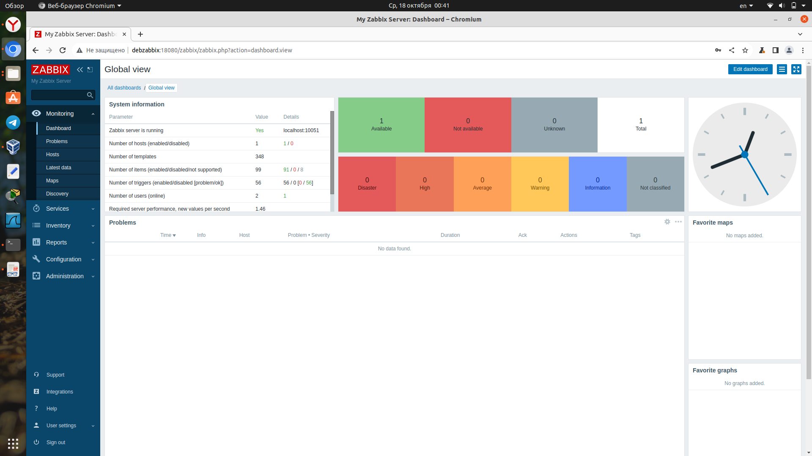

# Домашнее задание к занятию "`Система мониторинга Zabbix`" - `Аблогин Павел`


### Инструкция по выполнению домашнего задания

   1. Сделайте `fork` данного репозитория к себе в Github и переименуйте его по названию или номеру занятия, например, https://github.com/имя-вашего-репозитория/git-hw или  https://github.com/имя-вашего-репозитория/7-1-ansible-hw).
   2. Выполните клонирование данного репозитория к себе на ПК с помощью команды `git clone`.
   3. Выполните домашнее задание и заполните у себя локально этот файл README.md:
      - впишите вверху название занятия и вашу фамилию и имя
      - в каждом задании добавьте решение в требуемом виде (текст/код/скриншоты/ссылка)
      - для корректного добавления скриншотов воспользуйтесь [инструкцией "Как вставить скриншот в шаблон с решением](https://github.com/netology-code/sys-pattern-homework/blob/main/screen-instruction.md)
      - при оформлении используйте возможности языка разметки md (коротко об этом можно посмотреть в [инструкции  по MarkDown](https://github.com/netology-code/sys-pattern-homework/blob/main/md-instruction.md))
   4. После завершения работы над домашним заданием сделайте коммит (`git commit -m "comment"`) и отправьте его на Github (`git push origin`);
   5. Для проверки домашнего задания преподавателем в личном кабинете прикрепите и отправьте ссылку на решение в виде md-файла в вашем Github.
   6. Любые вопросы по выполнению заданий спрашивайте в чате учебной группы и/или в разделе “Вопросы по заданию” в личном кабинете.
   
Желаем успехов в выполнении домашнего задания!
   
### Дополнительные материалы, которые могут быть полезны для выполнения задания

1. [Руководство по оформлению Markdown файлов](https://gist.github.com/Jekins/2bf2d0638163f1294637#Code)

---

### Задание 1


`Выполнена установка Zabbix Server и Zabbix Web Server, PostgreSQL и Apache`

```
В процессе установки выполнены команды:
wget https://repo.zabbix.com/zabbix/6.0/debian/pool/main/z/zabbix-release/zabbix-release_6.0-5+debian12_all.deb
sudo dpkg -i zabbix-release_6.0-5+debian12_all.deb
sudo apt update
sudo apt install postgresql
apt install zabbix-server-pgsql zabbix-frontend-php php8.2-pgsql zabbix-apache-conf zabbix-sql-scripts zabbix-agent
sudo apt install zabbix-server-pgsql zabbix-frontend-php php8.2-pgsql zabbix-apache-conf zabbix-sql-scripts zabbix-agent
sudo vim /etc/zabbix/zabbix_server.conf
sudo -u postgres createuser --pwprompt zabbix
sudo -u postgres createdb -O zabbix zabbix
zcat /usr/share/zabbix-sql-scripts/postgresql/server.sql.gz | sudo -u zabbix psql zabbix
sudo systemctl zabbix-server zabbix-agent apache2
sudo systemctl restart zabbix-server zabbix-agent apache2
sudo systemctl status zabbix-server.service 
sudo systemctl enable zabbix-server.service zabbix-agent apache2

```

`Скриншот админки`



---

### Задание 2


1. `Установил Zabbix Agent на 2 вирт.машины: deb1, deb2`
2. `Добавил Zabbix Server в список разрешенных серверов Zabbix Agentов.`
3. `Добавил Zabbix Agentов в раздел Configuration > Hosts Zabbix Servera.`

```
Для работы с GitHub использовались команды:

git clone git@github.com:qu1ckb1t/zabbix_hw.git
git status
nano .git/.gitignore
git add README.md 
git commit -m "First commit"
git push origin
git status
git add .
git commit -m "Добавил результат выполнения задания 1"
git push
git status
git add .
git commit -m "Добавление решения для задания 2"
git push origin

```

`Скриншоты к заданию 2
``
``
``

---

